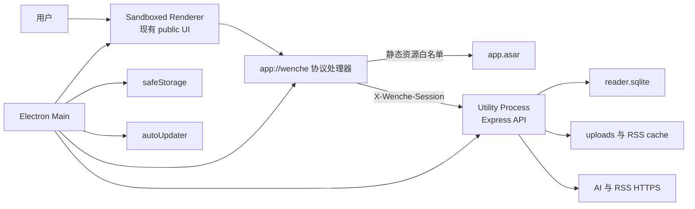

# 桌面版目标架构

本文使用“必须”“不得”“应”表示规范性要求。除非本文明确给出回退条件，否则 agent 不得把架构决定改成另一套实现。

## 1. 第一性原理

### 1.1 用户购买的是可运行产品，不是开发环境

桌面发行版必须包含运行应用所需的 Chromium、Node.js、服务端代码和前端资源。用户不安装 Node.js、不执行 npm、不理解端口，也不需要保留源码目录。安装、启动、更新、退出和卸载必须遵循普通 Windows 应用的预期。

### 1.2 程序与用户数据有不同生命周期

程序文件可以被安装器整体替换，用户数据库、原始文档、配置和密钥不能因此移动或丢失。因此：

- 应用包和安装目录只读；
- 持久数据只写 `%LOCALAPPDATA%\Wenche Reader`；
- 更新先关闭唯一数据库写入进程，再替换程序；
- 卸载默认不删除用户数据；
- 恢复和迁移继续以应用备份格式为跨目录契约。

### 1.3 不可信内容与系统权限必须隔离

文澈阅读会处理用户文件、Feed、网页正文、图片和模型输出，这些都是不可信输入。renderer 只能拥有浏览器页面权限，不能获得 Node、Electron、Shell 或任意 IPC 权限。系统密钥、更新器、文件路径和进程控制只存在于 Electron main；Express、解析器和 SQLite 位于独立 utility process。

### 1.4 回环地址不是认证

`127.0.0.1` 只限制网络范围，不证明请求来自文澈阅读。同一登录会话中的其他进程可以扫描端口并发起请求。桌面后端必须使用随机端口和每次启动随机令牌，并拒绝所有未认证访问。

### 1.5 单机应用仍然需要明确的一致性模型

SQLite 只允许一个长期拥有者。main 和 renderer 不直接打开数据库；utility process 是唯一数据库进程，并同时拥有 RSS 调度器。退出时必须按“停止接收请求 → 停调度器 → 关闭 HTTP → 关闭 SQLite”的顺序收敛。

### 1.6 最小新增边界比最小代码体积更重要

现有价值已经沉淀在原生前端、Express API、文档解析、provider adapter、RSS 和 SQLite 中。桌面化应复用这些边界，而不是为了减小安装包而引入 Rust、WebView2 差异和 Node sidecar 打包。Electron 的体积成本是已知且可接受的，重写业务的正确性成本更高。

## 2. 目标与非目标

### 2.1 目标

- 在没有 Node.js 的 Windows 10/11 x64 环境中安装并启动。
- 保留现有 Web/CLI 入口和全部业务功能。
- 使解析、SQLite 和 RSS 调度不阻塞 Electron main。
- 保证安装、重启和更新后数据仍在同一位置。
- 使用 OS 能力保护 AI Key，且不向 renderer 回显。
- 生成可签名、可安装、可自动更新、可在干净机器验收的产物。

### 2.2 非目标

- 不提供公网服务、多用户、云同步和账户体系。
- 不改变导入大小限制、AI 提示词、引用校验、备份格式和 RSS 产品规则。
- 不实现多窗口、多数据库实例、托盘常驻或开机自启。
- 不把浏览器版本废弃；`npm start` 仍是受支持的开发和本地 Web 入口。

## 3. 选型决定

采用 Electron 43 的最新稳定补丁版，原因是：

- Electron 自带 Chromium 和 Node，现有 DOM、DOCX、SSE、Express 与 `node:sqlite` 能直接复用；
- `utilityProcess.fork()` 提供带 Node 的独立服务进程，适合 SQLite 后端；
- Electron Forge、Squirrel.Windows、`autoUpdater`、`safeStorage` 和 fuses 构成完整桌面发行链路；
- 当前 UI 依赖 Chromium 行为，避免切换 WebView2 后重新验证全部排版差异。

Agent 写入依赖前必须执行 `npm.cmd view electron@43 version --json`，取返回列表中最高的非预发布版本并精确锁定。不得使用 `electron@latest`，因为 Electron 主版本有固定生命周期，升级主版本必须单独验证 Chromium、Node 和 `node:sqlite`。

## 4. 组件和信任边界



### 4.1 Electron main

main 只能承担以下职责：

- 注册自定义协议和安全 session；
- 设置 LocalAppData 路径；
- 申请单实例锁并聚焦已有窗口；
- 生成会话令牌；
- 读写非秘密配置并通过 `safeStorage` 加解密 AI Key；
- 启动和停止 utility process；
- 创建安全 BrowserWindow；
- 限制导航、权限和外部链接；
- 检查、下载和安装签名更新；
- 写入经过脱敏和轮转的桌面生命周期日志。

main 不解析文档、不调用模型、不执行 RSS 抓取、不打开 SQLite、不实现业务 API。

### 4.2 Utility process

utility process 是现有 Node 后端的桌面宿主，拥有：

- Express API；
- `Storage`/`DatabaseSync`；
- `RssService` 和 `RssScheduler`；
- 文档解析和原始文件生命周期；
- AI provider 实例和流式响应；
- RSS 抓取、全文提取和图片缓存。

utility process 只监听 `127.0.0.1`，端口传入 `0`。它不得使用命令行参数、环境变量或日志传递 API Key、会话令牌和签名凭据；这些值通过父子进程消息在内存中传递。

### 4.3 Renderer

主窗口必须使用：

```js
{
  nodeIntegration: false,
  nodeIntegrationInWorker: false,
  nodeIntegrationInSubFrames: false,
  contextIsolation: true,
  sandbox: true,
  webviewTag: false,
  navigateOnDragDrop: false,
  devTools: !app.isPackaged
}
```

生产窗口只加载 `app://wenche/`。现有导入 HTML 仍在禁用脚本的 sandbox iframe 中显示；不得因为已经运行于 Electron 就放宽清洗、CSP 或 iframe 限制。

preload 只暴露不可组合成任意系统操作的窄接口，具体见 [IMPLEMENTATION_SPEC.md](IMPLEMENTATION_SPEC.md)。不得暴露 `ipcRenderer`、文件路径、`shell`、`process.env` 或通用 `invoke(channel, args)`。

## 5. 自定义协议

### 5.1 注册

在 `app.ready` 前调用一次 `protocol.registerSchemesAsPrivileged`，注册 `app`：

```js
{
  scheme: "app",
  privileges: {
    standard: true,
    secure: true,
    supportFetchAPI: true,
    stream: true,
    codeCache: true
  }
}
```

不得启用 `bypassCSP`。窗口和协议处理器必须使用同一个显式 session；若窗口设置了 partition，协议必须注册到该 partition 对应的 session，不能依赖默认 session 的隐式行为。

### 5.2 路由

协议只接受 host `wenche`：

- `app://wenche/` 映射到 `public/index.html`；
- `app://wenche/<path>` 只映射到规范化后仍位于 `public/` 内的文件；
- `/vendor/*` 只允许实现规格列出的四个确定文件；
- `/api/*` 保留路径和 query，代理到 `http://127.0.0.1:<random-port>`；
- `/desktop-error.html` 映射到打包内的只读错误页；
- 其他 host、路径逃逸、用户名、密码和无效 URL 一律返回 400/404。

静态 HTML 响应必须带与现有服务等价或更严格的 CSP。协议处理器不得接受一个目标 URL 参数，也不得成为通用网络或文件代理。

### 5.3 API 转发

转发请求时：

- 保留 method、query、body、`Accept`、`Content-Type`、`Range` 和必要缓存头；
- 删除 `Host`、`Origin`、`Referer`、`Cookie`、`Authorization`、所有 `Proxy-*` 和调用方提供的 `X-Wenche-Session`；
- 由 main 写入唯一可信的 `X-Wenche-Session`；
- 不跟随到非回环地址的重定向；后端不应返回此类重定向；
- 直接返回 `net.fetch()` 的 Response，使 SSE、下载和源文件响应保持流式，不把整份响应读入内存。

## 6. 启动生命周期

启动顺序是规范的一部分：

1. 在 `ready` 前注册 `app` scheme，确定数据根目录，并调用 `app.requestSingleInstanceLock()`。
2. 未获得锁时立即退出；获得锁后注册 `second-instance`，只恢复并聚焦现有窗口。
3. `app.whenReady()` 后初始化日志与安全 session。
4. main 读取 `settings.json`，用 `safeStorage` 解密 AI Key，并生成 32 字节随机会话令牌。
5. main 使用 `utilityProcess.fork()` 启动 `desktop/backendWorker.js`，通过消息发送 bootstrap 数据。
6. worker 创建运行时，监听 `127.0.0.1:0`，启动 RSS 调度器，然后发送 `backend-ready` 和实际端口。
7. main 收到 ready 后注册协议 handler，创建 BrowserWindow 并加载 `app://wenche/`。
8. 15 秒内没有 ready、worker 提前退出或启动失败时，不创建业务窗口；改为显示打包内错误页，提供“重新启动应用”和“打开日志目录”，不得无限自动重启。

BrowserWindow 不能在后端 ready 前加载业务页面，避免把随机端口、半初始化数据库或错误状态暴露成竞态。

## 7. 正常退出

Windows 主窗口关闭后触发应用退出，不留后台进程。main 在 `before-quit` 中只执行一次以下协议：

1. 停止接受新的更新安装和窗口动作；
2. 向 worker 发送 `shutdown-request`；
3. worker 停止 RSS 调度器；
4. worker 调用 `server.close()`，拒绝新连接并等待现有请求结束；
5. worker 调用 `storage.close()`；
6. worker 发送 `shutdown-complete` 并退出；
7. main 收到确认后继续退出。

优雅关闭上限为 5 秒。超时后 main 可以 `child.kill()`，记录脱敏错误并继续退出。更新器的 `quitAndInstall()` 必须复用同一关闭路径，不能绕过数据库关闭。

## 8. 异常语义

- worker 运行期异常退出：main 将 `/api/*` 返回 503，切换到错误页并保留日志；不在同一会话中自动重启 worker。
- SQLite 打开或迁移失败：不得创建新的空数据库覆盖原文件；显示数据错误并提供日志位置。
- AI 配置解密失败：保留加密文件，按“未配置 Key”启动，UI 明确提示重新保存；不得删除无法解密的文件。
- 更新检查失败：不影响阅读、导入、RSS 本地数据或应用退出。
- 网络离线：应用必须正常启动，AI 与 RSS 分别显示原有可读错误。

## 9. 唯一允许的协议回退

主方案必须先实现和测试 `app://`。只有当固定的 Electron 43 补丁版中，`protocol.handle()` + `net.fetch()` 无法通过以下任一自动测试时，才允许回退：

- SSE 至少接收两个分离的 `delta` 后再收到 `done`；
- DOCX/PDF 源文件可用 Range 请求读取；
- 150 MB 上限内的备份下载不会被协议层整体缓冲；
- renderer 的 `localStorage` 在重启后保持。

回退实现必须同时满足：

- BrowserWindow 加载随机 `http://127.0.0.1:<port>`，绝不使用固定 3000；
- main 通过 Electron session 预置 `HttpOnly`、`SameSite=Strict`、会话期 Cookie；
- Express 验证 Cookie、精确 Origin、Host 和 `Sec-Fetch-Site`；
- CORS 不允许任何外部 Origin；
- renderer 仍保持 sandbox、context isolation 和 nodeIntegration=false；
- 自动测试中证明直接无 Cookie 请求、跨站表单和跨站 fetch 均失败。

采用回退时，agent 必须在本文末尾追加失败测试、Electron 精确版本和选择回退的证据。不得因为实现方便而主动选择回退。

## 10. 参考资料

- [Electron Process Model](https://www.electronjs.org/docs/latest/tutorial/process-model)
- [Electron utilityProcess](https://www.electronjs.org/docs/latest/api/utility-process)
- [Electron parentPort](https://www.electronjs.org/docs/latest/api/parent-port)
- [Electron protocol.handle](https://www.electronjs.org/docs/latest/api/protocol)
- [Electron net.fetch](https://www.electronjs.org/docs/latest/api/net)
- [Electron Security](https://www.electronjs.org/docs/latest/tutorial/security)

